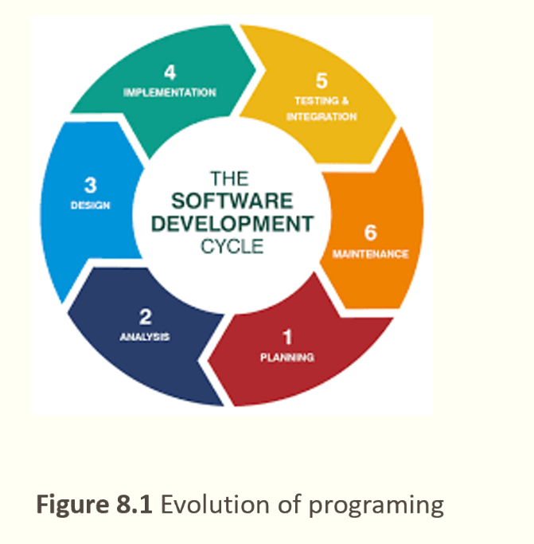
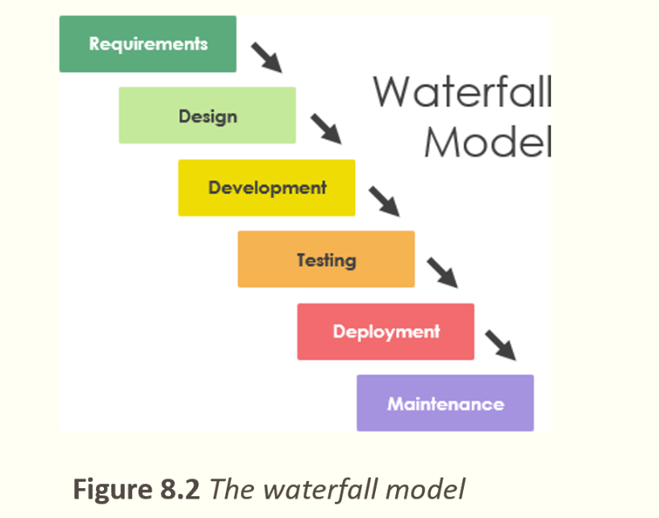
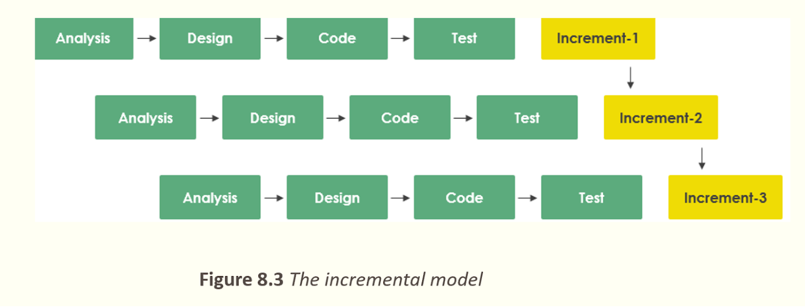

# Chương 8 – Software Engineering (Kỹ thuật phần mềm)

## 8.1 The software lifecycle – Vòng đời phát triển phần mềm

*   **Software lifecycle:** Includes phases such as analysis, design, implementation, and testing. → *Vòng đời phần mềm:* Bao gồm các giai đoạn như phân tích, thiết kế, triển khai và kiểm thử.

*   **Waterfall model:** Sequential development process. → *Mô hình thác nước:* Quá trình phát triển tuần tự.

*   **Incremental model:** Development through repeated iterations. → *Mô hình gia tăng:* Phát triển thông qua các vòng lặp đi lặp lại.

## 8.2 Analysis phase – Giai đoạn phân tích

*   **Procedure-oriented analysis:** Focuses on procedures and functions. → *Phân tích hướng thủ tục:* Tập trung vào quy trình và chức năng.
*   **Object-oriented analysis:** Focuses on objects and their relationships. → *Phân tích hướng đối tượng:* Tập trung vào đối tượng và mối quan hệ giữa chúng.

## 8.3 Design phase – Giai đoạn thiết kế

*   **Procedure-oriented design:** Designs systems around functions and flow of data. → *Thiết kế hướng thủ tục:* Thiết kế hệ thống xung quanh các chức năng và luồng dữ liệu.
*   **Object-oriented design:** Uses classes and objects. → *Thiết kế hướng đối tượng:* Dùng lớp và đối tượng để tổ chức hệ thống.

## 8.4 Implementation phase – Giai đoạn hiện thực

*   Involves coding and translating design into actual programs. → *Bao gồm việc lập trình và chuyển thiết kế thành chương trình thực tế.*

## 8.5 Testing phase – Giai đoạn kiểm thử

*   **Glass-box testing:** Tests internal structure. → *Kiểm thử hộp kính:* Kiểm thử cấu trúc bên trong của chương trình.
*   **Black-box testing:** Tests functionality without knowing internal code. → *Kiểm thử hộp đen:* Kiểm tra chức năng mà không cần biết mã nội bộ.

*Sau này còn có thêm deploy, maintain nữa*